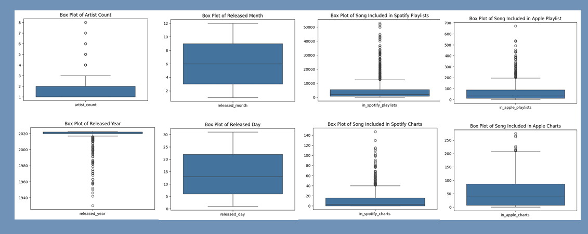
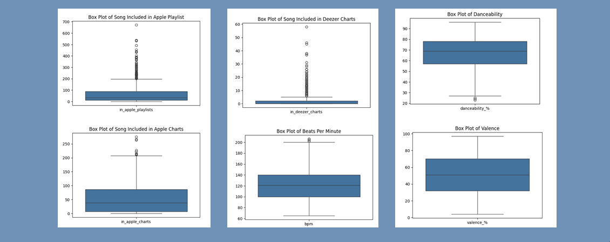
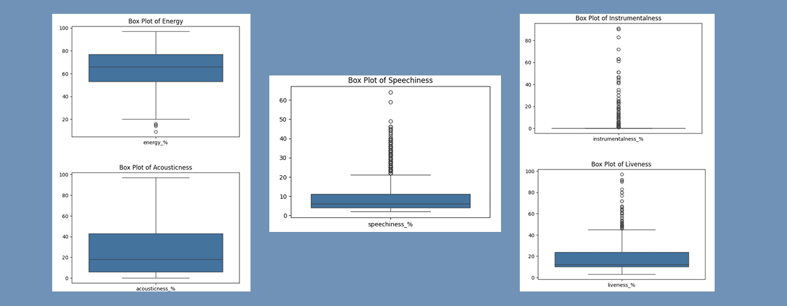

# Analysis of Music Streaming Trends using K-Means Clustering

This project analyzes a dataset of popular songs from various streaming platforms (Spotify, Apple Music, and Deezer) to identify musical trends and listener preferences. Using data science techniques, the project groups songs into distinct clusters and examines how different audio attributes correlate with a song's popularity.

## 🎯 Project Objectives

This analysis addresses the following key questions:

* How can songs from different streaming platforms be grouped into distinct segments based on their audio attributes (e.g., tempo, energy, danceability)?
* What is the correlation between specific audio attributes and a song's popularity (measured by streams)?
* How does song clustering relate to the average number of streams?
* Are there significant differences in the average stream counts between the identified music segments (clusters)?

---

## 👩‍🔬 Methodology

The project follows a data-driven approach using Python and several libraries within a Google Colab environment.

### Dataset and Tools

The dataset, titled "Popular Spotify Songs," is a compilation of information from multiple streaming services. It includes over 20 attributes per song, such as `track_name`, `artist(s)_name`, `released_year`, `streams`, `bpm`, and various audio features like `danceability_%` and `energy_%`.

The primary tools used for the analysis were:
* **pandas:** For data cleaning and manipulation.
* **matplotlib** and **seaborn:** For data visualization.
* **sklearn:** To perform K-Means Clustering and Principal Component Analysis (PCA).

### Data Processing and Clustering

1.  **Data Cleaning:** The initial dataset was cleaned by handling missing and duplicate values, and converting the `streams` column to a numeric format.
2.  **Feature Selection:** Seven core audio features were selected as inputs for the clustering model: `valence_%`, `danceability_%`, `energy_%`, `acousticness_%`, `instrumentalness_%`, `liveness_%`, and `speechiness_%`.
3.  **Normalization:** The selected features were normalized using `StandardScaler` to ensure all attributes had a uniform scale, preventing any single feature from dominating the clustering results.
4.  **K-Means Clustering:** The **Elbow Method** was used to determine the optimal number of clusters, which was found to be **6**. The K-Means algorithm was then applied to the normalized data to group the songs.

### Visualization and Analysis

Various plots were generated to visualize the data and the clustering results:
* **Box plots** were used to understand the distribution of numerical features and identify outliers.
   
* **Bar charts** and **line charts** were created to visualize song and artist popularity trends over time.
* **PCA** and **Pair Plots** were used to visualize the song clusters, showing the separation and relationships between the different groups.

---

## 📊 Key Findings

The analysis successfully clustered the songs into six distinct categories, each with unique characteristics and popularity metrics:

* **Cluster 0: Upbeat & Joyful Dance Hits**
* **Cluster 1: High-Energy Live Performances**
* **Cluster 2: Intense & Brooding Rhythmic Tracks**
* **Cluster 3: Rhythmic & Speech-Driven Grooves**
* **Cluster 4: Atmospheric & Melancholic Instrumentals**
* **Cluster 5: Mellow & Reflective Acoustic Pieces**

Notably, the analysis of average streams revealed that **"Mellow & Reflective Acoustic Pieces" (Cluster 5)** was the most popular cluster, followed by "Intense & Brooding Rhythmic Tracks" and "Upbeat & Joyful Dance Hits."
